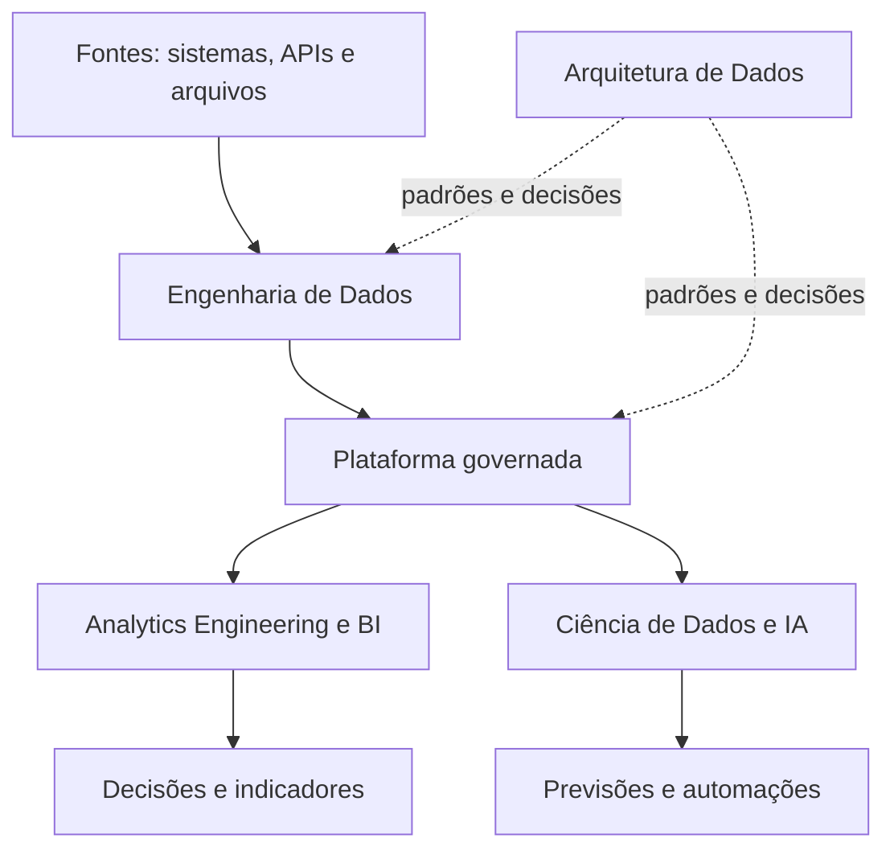

# Carreiras em Dados e Pós-Graduações no Brasil

## Guia comparativo para uma trajetória em Engenharia de Dados, Análise de Dados e Business Intelligence

**Perfil considerado:** profissional que já trabalha com extração de dados de diversas plataformas, centralização de informações, elaboração de relatórios e desenvolvimento em Power BI.  
**Data de referência da pesquisa:** 23 de agosto de 2026.  
**Escopo:** Engenharia de Dados, Arquitetura de Dados, Ciência de Dados, Análise de Dados, Business Intelligence, Inteligência Artificial e levantamento de pós-graduações brasileiras relacionadas.

---

## 1. Resumo executivo

As áreas de dados não são profissões isoladas que competem entre si. Elas representam partes diferentes de uma cadeia de valor:

1. A **Engenharia de Dados** constrói os mecanismos que capturam, transportam, processam e disponibilizam os dados.
2. A **Arquitetura de Dados** define os padrões, princípios e decisões estruturais que orientam essa plataforma.
3. A **Análise de Dados** interpreta informações e responde perguntas do negócio.
4. O **Business Intelligence** organiza métricas, modelos analíticos, relatórios e dashboards para apoiar a gestão.
5. A **Ciência de Dados** utiliza estatística, experimentação e aprendizado de máquina para explicar comportamentos e fazer previsões.
6. A **Inteligência Artificial** pode ser uma especialização técnica, um conjunto de produtos ou uma camada transversal usada por todas as outras áreas.

Para o perfil considerado neste documento, a evolução mais coerente é:

> **BI e Análise de Dados → Analytics Engineering → Engenharia de Dados → Arquitetura de Dados**

Isso não significa abandonar Power BI. Significa passar da camada final de visualização para a construção de todo o fluxo que alimenta os relatórios: APIs, bancos, pipelines, transformações, testes, orquestração, cloud, data lake/lakehouse, observabilidade e governança.

### Recomendação central

A pós-graduação ideal deve dedicar a maior parte de sua carga a:

- Python e SQL avançados;
- modelagem relacional, dimensional e analítica;
- APIs e ingestão de dados;
- ETL e ELT;
- dbt e Analytics Engineering;
- Airflow ou outro orquestrador;
- Spark e processamento distribuído;
- Kafka e streaming;
- AWS, Azure ou Google Cloud;
- Data Warehouse, Data Lake e Lakehouse;
- testes e qualidade de dados;
- catálogo, linhagem e governança;
- Docker, CI/CD, infraestrutura como código e DataOps;
- projeto prático que possa ser publicado no GitHub.

Uma pós que utilize grande parte da carga para ensinar novamente dashboards básicos, fórmulas elementares de Power BI ou estatística introdutória provavelmente proporcionará menos avanço.

---

# Parte I — Profissões e áreas de dados

## 2. Visão geral da cadeia de dados



Em empresas pequenas, uma única pessoa pode exercer diversas dessas funções. Em organizações maiores, as responsabilidades normalmente são distribuídas entre equipes diferentes.

## 3. Comparação rápida das profissões

| Área | Pergunta principal | Entregas típicas | Ênfase predominante |
|---|---|---|---|
| Engenharia de Dados | Como fazer os dados chegarem corretos, disponíveis e escaláveis? | Pipelines, integrações, tabelas, data lake, lakehouse, automações | Software, bancos, cloud e operação |
| Arquitetura de Dados | Como todo o ecossistema deve ser estruturado? | Padrões, diagramas, decisões arquiteturais, governança | Visão sistêmica e longo prazo |
| Análise de Dados | O que aconteceu, por que aconteceu e o que devemos acompanhar? | Análises, relatórios, recomendações e indicadores | Negócio, SQL, estatística descritiva |
| Business Intelligence | Como transformar dados corporativos em informação gerencial confiável? | Dashboards, KPIs, modelos dimensionais e camada semântica | Gestão, métricas, visualização e modelagem |
| Ciência de Dados | O que provavelmente acontecerá e quais padrões não são óbvios? | Modelos preditivos, experimentos, segmentações e previsões | Estatística, matemática e machine learning |
| Inteligência Artificial | Como automatizar decisões ou criar sistemas capazes de gerar, interpretar e agir? | Modelos, agentes, sistemas de recomendação, visão e linguagem | Machine learning, software e produto |
| Analytics Engineering | Como transformar dados brutos em conjuntos confiáveis para análise e BI? | Modelos analíticos, testes, documentação, métricas e transformações | SQL, dbt, modelagem e qualidade |

---

## 4. Engenharia de Dados

### 4.1 O que é

Engenharia de Dados é a disciplina responsável por construir e manter a infraestrutura lógica e técnica que permite que os dados sejam coletados, transportados, transformados, armazenados e consumidos.

O engenheiro não trabalha apenas com grandes volumes. Mesmo uma empresa de médio porte precisa de engenharia quando integra ERP, CRM, mídia paga, plataformas financeiras, bancos de dados, planilhas e sistemas próprios.

### 4.2 O que o profissional faz

- integra APIs, bancos, arquivos e sistemas;
- cria pipelines batch e streaming;
- desenvolve processos ETL e ELT;
- modela bancos e estruturas analíticas;
- mantém Data Warehouses, Data Lakes e Lakehouses;
- automatiza cargas e transformações;
- implementa testes de qualidade;
- monitora falhas, atrasos e custos;
- documenta tabelas, regras e linhagem;
- controla permissões e segurança;
- prepara dados para BI, análise, Ciência de Dados e IA;
- otimiza consultas e processamento;
- participa de decisões de cloud e arquitetura.

### 4.3 Tecnologias comuns

- SQL;
- Python, Java ou Scala;
- PostgreSQL, SQL Server, Oracle e MySQL;
- MongoDB, Cassandra, Redis e outros bancos NoSQL;
- Airflow, Dagster ou Prefect;
- dbt;
- Spark e Databricks;
- Kafka;
- Docker e Kubernetes;
- Git e CI/CD;
- Terraform;
- AWS, Azure e Google Cloud;
- Snowflake, BigQuery, Redshift, Synapse ou Fabric;
- ferramentas de catálogo, qualidade e observabilidade.

### 4.4 O que se estuda

- programação;
- algoritmos e estruturas de dados;
- bancos relacionais e não relacionais;
- modelagem de dados;
- sistemas distribuídos;
- computação em nuvem;
- integração de sistemas e APIs;
- ETL/ELT;
- processamento batch e streaming;
- segurança e governança;
- testes e engenharia de software;
- DevOps e DataOps.

### 4.5 Perfil profissional

Costuma ser adequado para quem gosta de construir, automatizar, investigar falhas, organizar processos e trabalhar com a parte estrutural dos dados. É menos orientado à apresentação executiva e mais orientado à confiabilidade da plataforma.

### 4.6 Valorização no mercado

Em geral, Engenharia de Dados apresenta remuneração elevada e boa demanda porque existe escassez relativa de profissionais que combinem programação, bancos, cloud e conhecimento de dados. A barreira técnica de entrada tende a ser maior que em funções iniciais de análise e BI.

---

## 5. Arquitetura de Dados

### 5.1 O que é

Arquitetura de Dados define como os dados serão organizados em toda a empresa: tecnologias, padrões, integrações, governança, segurança, disponibilidade, escalabilidade e ciclo de vida.

Enquanto o engenheiro constrói grande parte da solução, o arquiteto define como as peças devem se relacionar e quais princípios devem orientar as implementações.

### 5.2 O que o profissional faz

- desenha arquiteturas de referência;
- escolhe padrões de integração e armazenamento;
- define quando utilizar Warehouse, Lake ou Lakehouse;
- avalia soluções cloud, híbridas e locais;
- estabelece domínios, produtos de dados e contratos;
- define padrões de segurança e acesso;
- trabalha com catálogo, metadados e linhagem;
- avalia custos, desempenho, disponibilidade e riscos;
- revisa projetos elaborados pelas equipes de engenharia;
- alinha tecnologia, governança e estratégia empresarial.

### 5.3 O que se estuda

- modelagem corporativa;
- arquitetura de soluções;
- sistemas distribuídos;
- cloud;
- governança e DAMA-DMBOK;
- segurança e privacidade;
- Data Mesh, Lakehouse e arquiteturas orientadas a eventos;
- integração e interoperabilidade;
- gestão de metadados;
- custos e desempenho.

### 5.4 Momento típico da carreira

Arquitetura raramente é uma função de entrada. O arquiteto precisa compreender as consequências práticas de decisões técnicas. Por isso, normalmente chega à função depois de experiência como engenheiro, administrador de banco, desenvolvedor, especialista de BI ou líder técnico.

### 5.5 Valorização no mercado

Pode estar entre as funções mais bem remuneradas, mas existem menos vagas. A valorização decorre da senioridade, da responsabilidade sobre decisões de longo prazo e do impacto financeiro de uma arquitetura mal planejada.

---

## 6. Ciência de Dados

### 6.1 O que é

Ciência de Dados utiliza estatística, programação, conhecimento do negócio e aprendizado de máquina para encontrar padrões, testar hipóteses, estimar resultados e construir modelos preditivos.

### 6.2 O que o profissional faz

- explora dados e formula hipóteses;
- prepara bases para modelagem;
- cria previsões, classificações e segmentações;
- desenvolve sistemas de recomendação;
- executa experimentos e testes A/B;
- avalia métricas de modelos;
- explica resultados para áreas de negócio;
- acompanha degradação e vieses;
- trabalha com engenheiros para colocar modelos em produção.

### 6.3 O que se estuda

- probabilidade e estatística;
- álgebra linear e cálculo em diferentes níveis;
- Python ou R;
- análise exploratória;
- machine learning;
- validação de modelos;
- séries temporais;
- experimentação;
- visualização;
- ética, vieses e explicabilidade;
- MLOps, em formações mais completas.

### 6.4 Perfil profissional

É adequada para quem gosta de matemática, investigação, incerteza e experimentação. Nem todo problema corporativo precisa de um modelo de machine learning; muitas vezes uma boa consulta SQL e um indicador confiável resolvem melhor o problema.

### 6.5 Valorização no mercado

Continua sendo uma área valorizada, principalmente em níveis pleno e sênior. Porém, a entrada pode ser competitiva: há muitos cursos introdutórios e menos vagas realmente juniores. O profissional que também entende engenharia, cloud e implantação de modelos tende a se diferenciar.

---

## 7. Análise de Dados

### 7.1 O que é

Análise de Dados converte dados em respostas para problemas de negócio. O analista investiga resultados, identifica variações, constrói indicadores e comunica conclusões para apoiar decisões.

### 7.2 O que o profissional faz

- extrai dados com SQL, planilhas, APIs ou ferramentas de BI;
- limpa e combina bases;
- acompanha KPIs;
- cria análises exploratórias;
- identifica causas de variação;
- prepara apresentações e relatórios;
- responde perguntas de áreas comerciais, financeiras e operacionais;
- recomenda ações;
- valida consistência e regras de negócio.

### 7.3 O que se estuda

- SQL;
- Excel;
- Power BI, Tableau ou Looker;
- estatística descritiva;
- visualização e storytelling;
- métricas e indicadores;
- modelagem dimensional básica;
- conhecimento de negócio;
- Python, em funções mais técnicas.

### 7.4 Perfil profissional

É adequada para quem gosta de investigar, conversar com usuários, compreender o negócio e explicar resultados. Comunicação e domínio do contexto empresarial podem ser tão importantes quanto a ferramenta.

### 7.5 Valorização no mercado

É uma das principais portas de entrada. Por isso, há muitas vagas, mas também grande concorrência. A valorização aumenta quando o analista domina SQL, modelagem, automação, estatística e conhecimento de um setor específico, deixando de ser apenas operador de dashboards.

---

## 8. Business Intelligence

### 8.1 O que é

Business Intelligence é uma prática organizacional que reúne dados, métricas, processos e ferramentas para entregar informação gerencial confiável. BI não é apenas Power BI. Power BI é uma das ferramentas que implementam parte dessa função.

### 8.2 O que o profissional de BI faz

- levanta requisitos com gestores;
- define KPIs e regras de cálculo;
- desenvolve modelos dimensionais;
- cria camadas semânticas;
- implementa dashboards e relatórios;
- escreve SQL, DAX ou linguagens equivalentes;
- controla acesso e atualização;
- padroniza conceitos como receita, conversão e margem;
- acompanha adoção e desempenho dos relatórios;
- pode executar ETL, especialmente em equipes menores.

### 8.3 Onde BI se aproxima das outras áreas

- aproxima-se da Análise quando interpreta indicadores;
- aproxima-se da Engenharia quando cria integrações e processos de carga;
- aproxima-se da Arquitetura quando define modelos corporativos;
- aproxima-se da Ciência quando incorpora previsões;
- aproxima-se da IA quando oferece consultas em linguagem natural, narrativas automáticas ou agentes analíticos.

### 8.4 Valorização no mercado

BI continua relevante, mas o profissional limitado a montar visuais simples enfrenta maior competição e pressão de ferramentas automáticas. A valorização cresce quando ele domina modelagem, DAX avançado, SQL, governança, arquitetura semântica e engenharia.

---

## 9. Analytics Engineering

### 9.1 O que é

Analytics Engineering ocupa o espaço entre Engenharia de Dados e Análise/BI. Seu objetivo é transformar dados brutos em modelos analíticos confiáveis, testados, documentados e reutilizáveis.

### 9.2 Atividades típicas

- desenvolver transformações principalmente em SQL;
- criar modelos no dbt;
- organizar camadas staging, intermediate e marts;
- implementar testes de unicidade, integridade e regras de negócio;
- documentar colunas e modelos;
- controlar versões no Git;
- manter linhagem;
- definir métricas padronizadas;
- preparar tabelas para Power BI e outras ferramentas.

### 9.3 Por que é especialmente relevante neste caso

É provavelmente a transição mais natural para quem já centraliza dados e trabalha com Power BI. Aproveita o conhecimento de negócio e modelagem analítica, adicionando práticas de engenharia de software e confiabilidade.

---

## 10. Inteligência Artificial

### 10.1 Onde a IA entra

IA não substitui automaticamente as outras funções. Ela depende de dados corretos, governados e disponíveis. Pode entrar em diferentes camadas:

| Área | Aplicações de IA |
|---|---|
| Engenharia de Dados | geração assistida de código, detecção de anomalias, mapeamento de schemas e documentação |
| Arquitetura | análise de padrões, otimização de custos e desenho de soluções com modelos e agentes |
| Análise e BI | perguntas em linguagem natural, narrativas automáticas, previsão e detecção de desvios |
| Ciência de Dados | desenvolvimento de modelos, NLP, visão computacional e sistemas de recomendação |
| Operações | agentes que executam fluxos, monitoram pipelines e auxiliam na resolução de incidentes |

### 10.2 IA como profissão

Existem funções específicas, como Engenheiro de Machine Learning, Engenheiro de IA, Especialista em IA Generativa e MLOps Engineer. Normalmente exigem base em software, dados, cloud, modelos e implantação.

### 10.3 Limitação importante

Sem dados confiáveis, IA apenas automatiza erros. Empresas que desejam implementar IA frequentemente descobrem primeiro a necessidade de engenharia, qualidade, catálogo, segurança e governança.

---

## 11. Sobreposição de responsabilidades

| Atividade | Eng. de Dados | Arquiteto | Cientista | Analista | BI | Analytics Engineer |
|---|:---:|:---:|:---:|:---:|:---:|:---:|
| Ingestão de APIs | Principal | Define padrão | Ocasional | Ocasional | Ocasional | Ocasional |
| Pipeline ETL/ELT | Principal | Define arquitetura | Participa | Pode executar | Pode executar | Principal na transformação |
| Modelagem dimensional | Forte | Define padrões | Usa | Usa | Principal | Principal |
| Dashboard | Apoia | Raramente | Pode criar | Principal | Principal | Apoia |
| Machine learning | Prepara e operacionaliza | Define plataforma | Principal | Usa resultados | Consome resultados | Prepara features/modelos analíticos |
| Cloud e infraestrutura | Principal | Principal | Usa | Pouco | Usa | Usa |
| Governança | Implementa | Principal | Cumpre | Cumpre | Define métricas | Implementa documentação e testes |
| Comunicação executiva | Ocasional | Forte | Forte | Principal | Principal | Moderada |

---

## 12. Qual área é mais valorizada?

Não existe uma resposta absoluta. Salário e empregabilidade variam conforme senioridade, setor, cidade, trabalho remoto, domínio de inglês, cloud e capacidade prática.

Uma tendência geral é:

- **Arquitetura de Dados:** remuneração alta, poucas vagas e exigência de muita experiência;
- **Engenharia de Dados:** boa demanda, remuneração alta e barreira técnica relevante;
- **Engenharia de IA/Machine Learning:** potencial elevado, mas exige especialização e base forte;
- **Ciência de Dados:** valorizada, porém com mercado de entrada mais competitivo;
- **Analytics Engineering:** função em crescimento, especialmente em empresas orientadas a cloud e dbt;
- **BI e Análise:** grande volume de oportunidades, maior concorrência em níveis iniciais e grande variação salarial.

O profissional mais valioso não é necessariamente o que domina mais ferramentas. É aquele que resolve um problema importante com confiabilidade, compreende o negócio e consegue manter a solução em produção.

---

## 13. Diagnóstico do perfil considerado

### Competências já demonstradas

- extração de dados de diferentes plataformas;
- centralização de bases;
- construção de relatórios;
- experiência em Power BI;
- entendimento das necessidades dos usuários;
- contato com problemas reais de integração e qualidade.

### Competências que provavelmente gerarão maior crescimento

- Python aplicado a pipelines;
- SQL avançado e otimização;
- APIs e autenticação;
- bancos e modelagem em maior profundidade;
- Git, testes e engenharia de software;
- dbt e Analytics Engineering;
- Airflow;
- Spark/Databricks;
- cloud;
- Data Lake e Lakehouse;
- Docker e CI/CD;
- qualidade, catálogo, linhagem e observabilidade;
- streaming e Kafka;
- inglês técnico.

### Cargos de transição possíveis

- Analista de BI Sênior;
- BI Developer;
- Analytics Engineer;
- Analista de Dados com foco em Engenharia;
- Desenvolvedor ETL;
- Engenheiro de Dados Júnior ou Pleno, conforme experiência prática;
- Engenheiro de BI;
- Especialista em Microsoft Fabric, caso permaneça no ecossistema Microsoft.

---

# Parte II — Pós-graduações pesquisadas

## 14. Critérios de avaliação

Os cursos foram avaliados segundo:

- profundidade em Engenharia de Dados;
- integração com Analytics e BI;
- atualização tecnológica;
- projetos e portfólio;
- modalidade e flexibilidade;
- reputação institucional;
- transparência da ementa;
- duração;
- investimento;
- aderência ao perfil profissional considerado.

Os termos **forte**, **médio** e **básico** nas tabelas são avaliações deste levantamento, e não notas oficiais.

## 15. Comparativo geral

| Instituição e curso | Formato e duração | Investimento divulgado | Engenharia | Analytics/BI | Diferencial |
|---|---|---:|---|---|---|
| [PUC Minas — Engenharia de Dados](https://vemprapuc.pucminas.br/engenharia-de-dados-ead-com-videoaulas) | Gravado, 360h, até 18 meses | R$ 5.804 à vista ou 24× R$ 260 | Muito forte | Médio | Melhor custo-benefício institucional |
| [Infnet — MBA Engenharia de Dados, Big Data e IA](https://posgraduacao.infnet.edu.br/ead/pos-graduacao-em-engenharia-de-dados-big-data/) | 100% ao vivo, cerca de 1 ano | Sob consulta | Muito forte | Médio | Stack moderna e oito projetos |
| [Xperiun — Pós Tech Engenharia de Dados & IA](https://xperiun.com/ed/postech/) | Digital, 12–18 meses | R$ 12.497 ou 21× R$ 697 | Forte | Muito forte | Power BI/Fabric, dbt e engenharia |
| [DSA — Engenharia Analítica](https://www.datascienceacademy.com.br/program/pos-graduacao-em-engenharia-analitica) | Assíncrono, 540h, 4–12 meses | R$ 6.360 ou 12× R$ 530 | Forte | Muito forte | Formação específica em Analytics Engineering |
| [Poli-USP — Engenharia de Dados e Big Data](https://pecepoli.com.br/especializacao-engenharia-de-dados-e-big-data-ead-sincrono-apresentacao/) | EAD síncrono, 474h, 22 meses | 22× R$ 1.290 + inscrição | Forte | Forte | Prestígio, rigor e integração com BI |
| [Impacta — MBA Data Engineering](https://mba.impacta.edu.br/mbas/data-engineering/) | Online ao vivo, 360h, cerca de 9 meses | A partir de 36× R$ 407,77 | Forte | Médio/forte | Arquitetura, engenharia e capstone |
| [FIA — Análise de Big Data: Data Engineering](https://fia.com.br/pos-graduacao-ead/analise-big-data-data-engineering/) | Online ao vivo ou presencial, 360h | Cerca de R$ 31.428 à vista | Muito forte | Médio/forte | Experiência premium e networking |
| [Mackenzie — MBA Engenharia de Dados](https://www.mackenzie.br/pos-graduacao/pos-e-mba/polo/tecnologia-da-informacao/mba-em-engenharia-de-dados) | 60% presencial, 432h, 20 meses | Sob consulta | Forte | Forte | Marca tradicional e formação híbrida |
| [XP Educação — Engenharia e Arquitetura de Dados com IA](https://xpeducacao.com.br/pos-graduacao/engenharia-arquitetura-dados) | Live 480h/12 meses ou Flex 360h/6 meses | Aproximadamente R$ 8.650 ou R$ 7.250 | Forte | Médio | Engenharia, arquitetura e IA |
| [FIAP — MBA Engenharia de Dados](https://www.fiap.com.br/mba/mba-em-engenharia-de-dados/) | Live ou híbrido, 360–400h | Não divulgado | Forte | Médio/forte | Ecossistema técnico abrangente |
| [Unisinos — Engenharia e Ciência de Dados](https://www.unisinos.br/pos/mba-e-especializacao/engenharia-e-ciencias-de-dados) | Aulas ao vivo | Sob consulta | Médio/forte | Forte | Engenharia combinada com Ciência de Dados |
| [Descomplica — Engenharia de Dados](https://descomplica.com.br/pos-graduacao/tecnologia/pos-em-engenharia-de-dados/) | Assíncrono, 360h, 12 meses | Promoções a partir de 18× R$ 79,90 | Básico/médio | Médio | Baixo investimento |
| [Faculdade Focus — Engenharia de Dados](https://faculdadefocus.com.br/produto/pos-graduacao-em-engenharia-de-dados) | Assíncrono, 420h, 4–12 meses | Cerca de R$ 479 à vista | Básico | Médio | Certificação de custo muito baixo |

> Valores promocionais, datas e condições podem mudar. É necessário confirmar tudo diretamente com a instituição antes da matrícula.

---

## 16. PUC Minas — Engenharia de Dados

### Estrutura

- 360 horas;
- aulas gravadas;
- acesso imediato ou em até 72 horas;
- até 18 meses para conclusão;
- certificado digital PUC Minas;
- TCC facultativo e contratado separadamente;
- R$ 5.804 à vista ou 24 parcelas de R$ 260 na consulta realizada.

### Conteúdo publicado

- Python, Pandas, Matplotlib e Plotly;
- SQL, bancos relacionais e NoSQL;
- segurança, LGPD e governança;
- Data Warehouse e Data Lake;
- ETL/ELT, ingestão, catálogo, CDC e SCD;
- Spark, Spark Streaming e Kafka;
- AWS, Azure e Google Cloud;
- Docker, Kubernetes e infraestrutura como código;
- CI/CD, DataOps, MLOps e Airflow;
- Hadoop, Hive, HBase, Flink, Beam e outros componentes distribuídos.

### Avaliação

É a melhor relação geral entre conteúdo, preço, flexibilidade e reputação institucional. A principal limitação é a ausência de interação frequente ao vivo. Não enfatiza Power BI, mas isso pode ser uma vantagem para quem já domina a ferramenta.

---

## 17. Infnet — MBA Engenharia de Dados, Big Data e IA

### Estrutura

- aulas 100% ao vivo;
- aproximadamente um ano;
- segundas e quartas, das 20h às 22h;
- turma anunciada para 5 de outubro de 2026;
- 64 encontros;
- oito projetos práticos;
- sem TCC tradicional;
- preço sob consulta.

### Conteúdo publicado

- SQL avançado;
- dbt, testes, versionamento e linhagem;
- Spark, Spark SQL e streaming;
- Databricks, Delta Lake e Lakehouse;
- arquitetura medalhão;
- AWS Glue e Step Functions;
- Kafka, Connect, Streams e KSQL;
- Prometheus e observabilidade;
- Airflow;
- MLOps, feature stores e data drift.

### Avaliação

É uma das opções tecnicamente mais direcionadas às competências exigidas em Engenharia de Dados moderna. Os oito projetos são relevantes para uma transição de carreira. Exige familiaridade prévia com programação, SQL e Linux e compromisso com horários fixos.

---

## 18. Xperiun — Pós Tech Engenharia de Dados & IA

### Estrutura

- 360 horas;
- formato digital;
- conclusão em 12 a 18 meses;
- acesso por 24 meses;
- aulas gravadas e encontros quinzenais ao vivo;
- projetos por fase e formação de squads;
- sem TCC tradicional;
- 21 parcelas de R$ 697 ou R$ 12.497 à vista.

### Conteúdo publicado

- Python e SQL;
- Spark e Databricks;
- Airflow e dbt;
- Kafka;
- Data Lake e Lakehouse;
- AWS, Azure e Google Cloud;
- CI/CD e observabilidade;
- IA e LLMs;
- Power BI e Microsoft Fabric;
- Apache HOP;
- Analytics Engineering e Business Analytics.

### Avaliação

Apresenta a maior aderência direta à combinação Engenharia + Análise + BI. É uma ponte natural para quem já atua no ecossistema Power BI. Antes da compra, deve-se confirmar por escrito a instituição emissora do certificado, a distribuição das 360 horas e as entregas efetivas dos projetos.

---

## 19. Data Science Academy — Engenharia Analítica

### Estrutura

- 540 horas;
- 20 horas extracurriculares;
- 100% assíncrona;
- conclusão entre 4 e 12 meses;
- acesso por 24 meses;
- projeto final;
- R$ 6.360 ou 12 parcelas de R$ 530 na oferta consultada;
- certificado divulgado em parceria com a Faculdade Facint.

### Conteúdo relacionado à formação

- SQL e análise;
- modelagem e preparação;
- Power BI;
- pipelines;
- dbt e Airbyte;
- Terraform;
- AWS, Azure e Databricks.

### Avaliação

O conceito de Engenharia Analítica corresponde exatamente à fronteira entre Engenharia e BI. É uma candidata forte para estudo flexível. Entretanto, a página pública precisa ser complementada com a ementa detalhada, professores, projetos e ferramentas antes da matrícula.

A instituição também oferece [Pós-Graduação em Engenharia de Dados](https://www.datascienceacademy.com.br/program/pos-graduacao-em-engenharia-de-dados), com abordagem mais tradicional e carga divulgada de 424 horas.

---

## 20. Poli-USP — Engenharia de Dados e Big Data

### Estrutura

- 474 horas;
- EAD síncrono;
- aproximadamente 22 meses;
- aulas às terças, quartas e quintas, das 19h às 22h;
- 22 parcelas de R$ 1.290;
- inscrição de R$ 150;
- reajuste anual;
- projeto integrador e monografia;
- pré-requisitos de banco de dados e programação.

### Conteúdo publicado

- Engenharia de Dados e arquitetura de Big Data/BI;
- Data Warehouse, SCD, cargas incrementais e snapshots;
- relatórios, dashboards, UX, Python e Power BI;
- Spark e ecossistema Hadoop;
- governança, qualidade e Data Mesh;
- batch, streaming, DAGs, retries e alertas;
- catálogo, linhagem, Data Lake, Lakehouse e AWS;
- privacidade, ética e segurança.

### Avaliação

É uma das formações mais completas e possui grande peso acadêmico. Em contrapartida, demanda investimento aproximado de R$ 28 mil, quase dois anos e três noites por semana. A turma anunciada para fevereiro de 2026 já estava em andamento na data desta pesquisa; a próxima edição precisa ser consultada.

---

## 21. Impacta — MBA Data Engineering

### Estrutura

- 360 horas;
- online ao vivo;
- aproximadamente nove meses;
- sem TCC;
- capstone;
- preço anunciado a partir de 36 parcelas de R$ 407,77.

### Conteúdo publicado

- SQL, modelagem e Data Vault;
- AWS, Azure e Google Cloud;
- DAMA-DMBOK e governança;
- arquiteturas Lambda e Kappa;
- Data Lake, Delta Lake, Lakehouse e Data Mesh;
- Spark, streaming, Snowflake e Databricks;
- ETL/ELT, NoSQL, Python e APIs;
- Airflow, Terraform, Docker e Kubernetes;
- DataOps, microserviços e machine learning.

### Avaliação

Boa alternativa ao vivo e equilibrada. Parte da carga inclui conteúdos executivos, o que reduz o tempo estritamente técnico. Deve ser comparada ao Infnet pelo preço final, profundidade das disciplinas e qualidade dos projetos.

---

## 22. FIA — Análise de Big Data: Data Engineering

### Estrutura

- 360 horas;
- online ao vivo ou presencial;
- professor e monitor;
- atividades com dados reais;
- TCC;
- aproximadamente R$ 31.428 à vista;
- descontos relevantes para empresas conveniadas;
- novas turmas sem data precisa na consulta.

### Conteúdo publicado

- Python, SQL, Spark e Hadoop;
- MongoDB e Cassandra;
- dbt e Airflow;
- AWS, Azure e Google Cloud;
- MLOps;
- IA generativa, redes neurais, prompts e sistemas multiagentes.

### Avaliação

É uma experiência premium, com interação e potencial de networking. O preço é a principal limitação. Para o objetivo técnico considerado, é difícil justificar uma diferença tão elevada em relação a Infnet, PUC e Impacta sem avaliar professores, projetos e benefícios adicionais.

---

## 23. Mackenzie — MBA Engenharia de Dados

### Estrutura

- 432 horas;
- 20 meses;
- 60% presencial e 40% online;
- campus Berrini, São Paulo;
- quartas e sextas;
- preço sob consulta.

### Conteúdo publicado

- analytics e visualização;
- Data Science;
- governança e metadados;
- Data Lake, Lakehouse e Data Mesh;
- Python e R;
- coleta, armazenamento e Big Data;
- preparação e transformação;
- DevOps, DataOps, cloud e SRE;
- projetos hands-on, mentoria e carreira.

### Avaliação

Boa integração entre engenharia e analytics, além de marca tradicional. A exigência de 60% presencial restringe a escolha a quem mora em São Paulo ou pode viajar regularmente.

---

## 24. XP Educação — Engenharia e Arquitetura de Dados com IA

### Modalidades

**Live Flex**

- 480 horas;
- 12 meses;
- aulas gravadas e ao vivo;
- projeto aplicado;
- aproximadamente 18 parcelas de R$ 472,23 e matrícula de R$ 150.

**Flex**

- 360 horas;
- seis meses;
- conteúdo gravado;
- aproximadamente 18 parcelas de R$ 394,45 e matrícula de R$ 150.

### Estrutura publicada

- bootcamp Data Engineer;
- bootcamp Data Architect;
- bootcamp AI Data Engineer;
- AWS, Google Cloud e conteúdos Cisco;
- masterclasses de IA;
- competências comportamentais.

### Avaliação

É mais orientada a Engenharia, Arquitetura e IA do que a BI. A modalidade Live Flex é mais interessante devido ao projeto aplicado. A ementa pública precisa de maior granularidade para comparação técnica precisa.

---

## 25. FIAP — MBA Engenharia de Dados

### Formato publicado

- live ou híbrido;
- 360 a 400 horas;
- sem turma e preço disponíveis na data da pesquisa.

### Conteúdo publicado

- SQL e bancos relacionais;
- MongoDB, Cassandra, Scylla, Neo4j e Redis;
- BigQuery;
- Spark, Hive, Presto e Impala;
- NiFi, Kafka, dbt e Databricks;
- Kubeflow, Terraform e Airflow;
- APIs, webhooks e microserviços;
- Docker, RabbitMQ e Kubernetes;
- AWS, Azure e Google Cloud;
- machine learning e Data Mining.

### Avaliação

Possui marca forte em tecnologia e ampla lista de ferramentas. Como não há turma aberta, não é uma escolha imediata. Também é necessário avaliar se a extensa quantidade de tecnologias será trabalhada com profundidade.

A [Pós Tech Data Analytics](https://postech.fiap.com.br/curso/data-analytics) da FIAP aborda Power BI, BigQuery, Spark, Python, Streamlit, KPIs e machine learning, mas tende a repetir uma parte maior do repertório de quem já atua em BI.

---

## 26. Unisinos — Engenharia e Ciência de Dados

### Conteúdo publicado

- Big Data e Data Analytics;
- estatística;
- tipos avançados e modelagem;
- Python;
- governança e preparação;
- pipelines e visualização;
- machine learning e IA;
- desafio prático;
- integração com o ecossistema SAP.

### Avaliação

É adequada para quem deseja manter aberta a possibilidade de Ciência de Dados. A página pública não permite confirmar a mesma profundidade em Airflow, dbt, Kafka, CI/CD e observabilidade encontrada em cursos mais focados em engenharia.

---

## 27. Alternativas de baixo custo

### Descomplica — Engenharia de Dados

A [pós da Descomplica](https://descomplica.com.br/pos-graduacao/tecnologia/pos-em-engenharia-de-dados/) divulga 360 horas, 12 meses, aulas gravadas, Python, bancos, estatística, Pandas, Big Data, arquitetura de BI, ingestão, qualidade, cloud, machine learning e projetos integradores. Foram encontradas promoções a partir de 18 parcelas de R$ 79,90, sujeitas à confirmação no checkout.

É acessível, mas parece mais introdutória e generalista. Pode ser útil para base e certificação, mas tende a produzir menor avanço para quem já trabalha com dados.

### Faculdade Focus — Engenharia de Dados

A [pós da Faculdade Focus](https://faculdadefocus.com.br/produto/pos-graduacao-em-engenharia-de-dados) divulga 420 horas, conclusão entre 4 e 12 meses, análise exploratória, NoSQL, Big Data, Engenharia e Governança, dashboards, Power BI, Tableau e Data Mining. O preço consultado estava próximo de R$ 479 à vista.

O investimento é muito baixo, porém a ementa é genérica e não demonstra profundidade em Airflow, dbt, Kafka, Spark, cloud, testes, CI/CD e observabilidade. É mais indicada quando o objetivo principal é a credencial acadêmica de baixo custo.

---

## 28. Cursos mais voltados a BI e Analytics

- [Cruzeiro do Sul — MBA em Análise de Dados com BI e Big Data](https://cursos.cruzeirodosulvirtual.com.br/pos-mba-em-analise-de-dados-com-bi-e-big-data-cruzeiro-do-sul-virtual/p): Power BI, Tableau, ETL e Data Warehouse, com menor profundidade aparente em engenharia operacional.
- [INBEC — MBA Data Analytics & Business Intelligence](https://inbec.com.br/cursos/mba-data-analytics-business-intelligence-presencial): Python, SQL, ETL, modelagem dimensional, OLAP, Power BI, n8n e IA generativa.
- [Senac SP — Big Data](https://www.sp.senac.br/pos-graduacao/pos-em-big-data): gestão, governança, IA, segurança e Big Data, mas com menor transparência sobre uma stack prática de Engenharia de Dados.

Esses cursos podem ser bons para entrada em BI, mas apresentam maior risco de repetição para quem já trabalha diariamente com relatórios e Power BI.

---

## 29. Ranking personalizado

| Posição | Curso | Justificativa |
|---:|---|---|
| 1 | Infnet | Maior ganho técnico, stack moderna e projetos práticos |
| 2 | PUC Minas | Melhor equilíbrio entre preço, marca, flexibilidade e abrangência |
| 3 | Xperiun | Melhor continuidade entre Power BI, Fabric, Analytics Engineering e Engenharia |
| 4 | DSA Engenharia Analítica | Proposta diretamente alinhada a Engenharia + Análise, com flexibilidade |
| 5 | Poli-USP | Maior peso acadêmico, mas longa, intensa e cara |
| 6 | Impacta | Boa formação ao vivo, ampla e com capstone |
| 7 | FIA | Forte e premium, mas investimento muito elevado |
| 8 | XP Educação Live Flex | Boa combinação de Engenharia, Arquitetura e IA |
| 9 | FIAP | Grade forte, mas sem turma ou preço disponível |
| 10 | Unisinos | Boa combinação, porém mais próxima de Ciência de Dados |
| 11 | Descomplica | Alternativa introdutória e acessível |
| 12 | Faculdade Focus | Melhor para credencial de baixo custo do que para transição técnica |

O ranking representa aderência ao perfil analisado, não uma classificação absoluta da qualidade das instituições.

---

## 30. Recomendação por prioridade

### Maior evolução técnica

**Infnet**, desde que o investimento seja viável e exista disponibilidade para as aulas ao vivo.

### Melhor custo-benefício

**PUC Minas**, acompanhada de projetos próprios em GitHub para compensar a menor interação.

### Melhor transição a partir do Power BI

**Xperiun**, após validar certificado, carga horária e projetos.

### Melhor formação especificamente híbrida entre Engenharia e Análise

**DSA Engenharia Analítica**, após receber a ementa detalhada.

### Maior prestígio acadêmico

**Poli-USP**, se orçamento, prazo e disponibilidade não forem restrições.

### Alternativa ao vivo equilibrada

**Impacta**, especialmente se o preço final for inferior ao Infnet ou se a grade executiva também for valorizada.

---

## 31. Perguntas obrigatórias antes da matrícula

1. Qual instituição aparecerá no certificado?
2. A instituição emissora está devidamente credenciada?
3. Quantas horas são efetivamente técnicas?
4. As aulas são ao vivo, gravadas ou baseadas principalmente em leitura?
5. As aulas ao vivo ficam disponíveis depois?
6. Quais projetos poderão ser publicados no portfólio?
7. A instituição fornece ambiente cloud ou os custos ficam com o aluno?
8. Airflow, dbt, Spark e Kafka serão usados em projetos ou apenas apresentados?
9. O curso ensina testes automatizados e qualidade de dados?
10. Existem CI/CD, Docker, Terraform e observabilidade?
11. A formação aborda modelagem dimensional, camada semântica e integração com BI?
12. Quem são os professores e onde trabalham atualmente?
13. Há TCC, projeto final ou ambos?
14. Existe reajuste das parcelas?
15. Por quanto tempo o conteúdo permanecerá acessível?
16. Quais são os critérios para emissão do certificado?
17. Quais conhecimentos prévios de Python, SQL e Linux são necessários?
18. O projeto final cobre ingestão, armazenamento, transformação, orquestração, testes e consumo?
19. A instituição oferece apoio de carreira e revisão de portfólio?
20. Há comunidade ativa, monitoria e contato com professores?

---

## 32. Cuidados com a expressão “reconhecido pelo MEC”

Segundo o [Ministério da Educação](https://www.gov.br/mec/pt-br/acesso-a-informacao/perguntas-frequentes/educacao-superior-1/pos-graduacao-lato-sensu-e-stricto-sensu/os-cursos-de-pos-graduacao-lato), cursos de pós-graduação lato sensu não passam individualmente pelo mesmo processo de reconhecimento aplicado às graduações.

O ponto central é verificar:

- qual instituição de ensino superior emitirá o certificado;
- se ela está credenciada;
- se possui autorização adequada para a modalidade ofertada;
- se carga horária, avaliação e requisitos atendem às normas aplicáveis;
- se o contrato corresponde ao que foi anunciado.

Por isso, a frase comercial “curso reconhecido pelo MEC” não deve ser aceita isoladamente como garantia. O emissor do certificado e seu credenciamento precisam ser conferidos.

---

# Parte III — Plano recomendado de desenvolvimento

## 33. Formação ideal durante a pós

A pós deve ser acompanhada de projetos que comprovem capacidade prática. Uma sequência recomendada é:

### Projeto 1 — Pipeline de API para banco relacional

- API pública;
- Python;
- validação e tratamento;
- PostgreSQL;
- Docker;
- logs;
- testes;
- Power BI conectado à camada final.

### Projeto 2 — ELT com Analytics Engineering

- ingestão com Airbyte ou código;
- Data Warehouse cloud;
- dbt;
- modelos staging, intermediate e marts;
- testes e documentação;
- GitHub Actions;
- dashboard no Power BI.

### Projeto 3 — Lakehouse

- arquivos brutos;
- Spark ou Databricks;
- Delta Lake;
- camadas Bronze, Silver e Gold;
- controle de qualidade;
- orquestração com Airflow;
- observabilidade.

### Projeto 4 — Streaming

- Kafka;
- processamento em tempo real;
- armazenamento analítico;
- alertas;
- painel de acompanhamento.

### Estrutura esperada no GitHub

```text
README.md
architecture/
src/
dags/
dbt/
tests/
terraform/
docker/
docs/
```

O diploma ajuda a demonstrar formação formal. O portfólio demonstra que o profissional consegue construir aquilo que a vaga exige.

---

## 34. Conclusão final

Para alguém que já trabalha com extração, centralização, relatórios e Power BI, a escolha mais estratégica não é uma pós puramente voltada a Análise de Dados. O maior retorno tende a vir de uma formação em **Engenharia de Dados com elementos de Analytics Engineering, modelagem e BI**.

As melhores candidatas para uma decisão final são:

1. **Infnet**, pela profundidade técnica e pelos projetos;
2. **PUC Minas**, pelo custo-benefício e abrangência;
3. **Xperiun**, pela ponte com Power BI e Microsoft Fabric;
4. **DSA Engenharia Analítica**, pela combinação específica entre engenharia e análise;
5. **Poli-USP**, pelo prestígio e rigor;
6. **Impacta**, como alternativa ao vivo equilibrada.

A decisão definitiva deve comparar três fatores pessoais:

- orçamento máximo;
- disponibilidade para aulas ao vivo;
- importância atribuída ao nome da instituição em comparação com portfólio e aplicação prática.

---

# Parte IV — Comparação detalhada: PUC Minas × Xperiun

## 35. Conclusão do comparativo

A PUC Minas e a Xperiun oferecem propostas diferentes, embora ambas utilizem o título de Engenharia de Dados:

- a **PUC Minas** oferece formação ampla, acadêmica e estrutural, com forte cobertura de bancos, arquitetura, governança, segurança, cloud e operação;
- a **Xperiun** oferece formação mais orientada à prática, ao portfólio e às tecnologias específicas utilizadas nas vagas, especialmente dbt, Airflow, Databricks, Terraform, CI/CD, qualidade e Analytics Engineering.

Para o perfil analisado, a decisão depende principalmente da capacidade de desenvolver projetos por conta própria:

> Se o aluno consegue construir um portfólio de forma independente, a PUC Minas pode ser a estratégia de melhor custo-benefício. Se precisa que a própria pós conduza os projetos, a Xperiun é mais adequada para a transição profissional.

## 36. Comparação geral

| Critério | PUC Minas | Xperiun |
|---|---|---|
| Curso | Engenharia de Dados | Engenharia de Dados & IA |
| Carga horária | 360h | 360h |
| Duração | Até 18 meses | 12 a 18 meses |
| Formato | Totalmente assíncrono | Gravado + encontros quinzenais |
| Acesso | Durante os 18 meses | Plataforma por 24 meses |
| Aulas ao vivo | Não programadas | Quinzenais e gravadas |
| Projetos | Atividades por disciplina; sem capstone obrigatório claramente detalhado | Projetos por disciplina/fase e projeto final |
| Avaliação | 40% prova objetiva + 60% atividades | Data Challenges e projetos |
| TCC | Facultativo e contratado separadamente | Sem TCC tradicional |
| Certificado | Emitido diretamente pela PUC Minas | Gestão acadêmica e certificado vinculados à UNIFATEC em cooperação com a Xperiun |
| Valor à vista pesquisado | R$ 5.804 | R$ 12.497 |
| Valor parcelado pesquisado | R$ 6.240 | R$ 14.637 em 21× R$ 697 |
| Marca institucional | Muito forte | Especializada, mas menos conhecida |
| Engenharia prática | Forte | Muito forte |
| Analytics Engineering | Médio | Muito forte |
| Arquitetura e governança | Muito forte | Forte |
| Portfólio | Depende bastante do aluno | Integrado à proposta |
| Comunidade e networking | Limitados pelo formato assíncrono | Mais fortes |

As informações da PUC foram verificadas na [página oficial do curso](https://vemprapuc.pucminas.br/engenharia-de-dados-ead-com-videoaulas), no [ementário oficial](https://www.pucminas.br/Pos-Graduacao/IEC/Cursos/Documents/Ementas%20EAD/Engenharia%20de%20Dados.pdf) e no [documento de metodologia da PUC Virtual](https://www.pucminas.br/PucVirtual/Pos-Graduacao/Documents/metodologiadetalhada2024.pdf).

## 37. Estrutura e metodologia

### PUC Minas

A PUC organiza a especialização em 15 disciplinas de 24 horas, totalizando 360 horas. Cada disciplina tem duração média de quatro semanas.

A carga de 24 horas não significa necessariamente 24 horas de videoaulas. Segundo a metodologia institucional, são contabilizados:

- videoaulas;
- leituras;
- fóruns;
- atividades abertas;
- atividades objetivas;
- preparação e realização de provas;
- outros objetos de aprendizagem.

Em cada disciplina, 40 pontos são obtidos por uma prova objetiva online e os outros 60 pontos são distribuídos em atividades no ambiente virtual.

O curso é totalmente assíncrono, mas possui professores autores, professores mentores, atendimento pelo AVA, fóruns, biblioteca virtual e acesso ao Portal de Periódicos da Capes. Não há encontros periódicos ao vivo previstos.

### Xperiun

A Xperiun organiza a formação em cinco fases, combinando:

- conteúdo gravado;
- encontros quinzenais ao vivo;
- projetos práticos;
- Data Challenges;
- revisão de entregas;
- comunidade;
- microcertificados;
- materiais, códigos e templates.

Os encontros são divulgados para o período das 19h às 22h e ficam gravados. A avaliação é apresentada como construção de pipelines, modelos, scripts e arquiteturas, e não como prova objetiva tradicional.

### Avaliação

A PUC possui uma estrutura acadêmica mais convencional e organizada. A Xperiun aproxima avaliação e aprendizado do trabalho cotidiano de um time de Engenharia de Dados.

## 38. Python, SQL e fundamentos de software

### Python na PUC Minas

A disciplina de 24 horas inclui:

- fundamentos da linguagem;
- estruturas de dados;
- Pandas;
- Matplotlib e Plotly;
- conexão com bancos e arquivos;
- módulos de migração;
- processamento e extração;
- APIs;
- módulos serverless;
- multithreading;
- processamento distribuído.

### Python na Xperiun

Também possui 24 horas, com:

- estruturas, funções e exceções;
- código limpo;
- logging;
- testes unitários;
- automação;
- Pandas avançado;
- consumo de APIs;
- integração entre sistemas.

A Xperiun acrescenta disciplinas ou tópicos específicos sobre:

- Git e GitHub;
- branches, pull requests e code review;
- documentação técnica;
- FastAPI;
- Docker;
- CI/CD;
- pre-commit e linting.

### SQL e bancos na PUC Minas

A PUC distribui o assunto entre diferentes disciplinas:

- DDL e DML;
- modelagem relacional;
- diagrama entidade-relacionamento;
- bancos key-value, documentais, colunares e grafos;
- indexação;
- tuning relacional e NoSQL;
- benchmarks;
- triggers;
- backup e recuperação;
- monitoramento;
- alertas em cloud.

### SQL na Xperiun

A disciplina de 16 horas apresenta:

- SQL do básico ao avançado;
- joins;
- Window Functions;
- CTEs;
- modelagem relacional;
- índices;
- `EXPLAIN`;
- otimização;
- OLTP versus OLAP.

### Resultado

- **Bancos, administração e operação:** vantagem da PUC Minas.
- **Engenharia de Software aplicada a dados:** vantagem da Xperiun.
- **SQL aplicado a pipelines e analytics:** vantagem da Xperiun.

## 39. Data Warehouse, Data Lake, Lakehouse e modelagem

### PUC Minas

A formação aborda:

- Data Lake e Data Warehouse;
- dados estruturados e não estruturados;
- schema-on-write e schema-on-read;
- Logical Data Lake;
- Enterprise Data Hub;
- alta disponibilidade;
- dimensões em Data Warehouse;
- engines de Data Warehousing;
- organização de camadas;
- ambientes locais e cloud;
- CDC e Slowly Changing Dimension;
- áreas RAW;
- produtores e consumidores;
- dados de domínio como produto;
- plataformas self-service.

### Xperiun

A grade especifica:

- Data Warehouse, Data Lake e Lakehouse;
- Databricks;
- Delta Lake;
- arquitetura medalhão;
- camadas Bronze, Silver e Gold;
- Unity Catalog;
- fatos e dimensões;
- SCD;
- Data Vault;
- camada semântica;
- modelagem otimizada para BI;
- Delta Live Tables.

### Resultado

A PUC apresenta maior amplitude conceitual. A Xperiun está mais alinhada à implementação moderna de Lakehouse e ao consumo analítico.

- **Arquitetura conceitual:** PUC Minas.
- **Lakehouse e integração com BI:** Xperiun.

## 40. ETL, ELT, ingestão e orquestração

### PUC Minas

A PUC possui disciplinas de Ingestão e Catalogação e de Preparação, Orquestração e Fluxos, que incluem:

- CDC;
- SCD;
- conectores em tempo real;
- ETL e ELT;
- Complex Event Processing;
- schema registry;
- consistência e harmonização;
- áreas RAW;
- limpeza e enriquecimento;
- feature engineering;
- múltiplas fontes;
- escalonamento de jobs;
- reprocessamento;
- resiliência;
- orquestradores open source e cloud.

A página comercial cita Apache Airflow, mas o nome não aparece explicitamente no ementário oficial de janeiro de 2026. Portanto, não se deve presumir treinamento aprofundado na ferramenta sem confirmação da coordenação.

### Xperiun

A formação especifica:

- n8n;
- APIs com autenticação, paginação, retry e timeout;
- FastAPI;
- Airbyte e Fivetran;
- dbt;
- Airflow;
- Astronomer;
- AWS MWAA;
- cargas full e incrementais;
- CDC;
- Reverse ETL;
- testes, documentação e observabilidade.

A Xperiun atribui 24 horas ao Airflow e 24 horas ao dbt.

### Resultado

A PUC ensina os conceitos e problemas que um pipeline precisa resolver. A Xperiun informa as ferramentas e práticas que serão usadas para resolvê-los.

**Vantagem: Xperiun.**

## 41. Analytics Engineering e integração com BI

Este é o ponto de maior diferença para o perfil analisado.

### PUC Minas

A PUC aborda dimensões, ETL/ELT, Data Warehouse, camadas de consumo, visualização em Python, Feature Engineering e dados como produto. Não aparecem explicitamente no ementário:

- dbt;
- testes automatizados de modelos analíticos;
- documentação automatizada;
- Data Vault;
- ferramenta de BI;
- Microsoft Fabric;
- integração contínua aplicada ao dbt.

### Xperiun

A terceira fase é dedicada a Analytics Engineering e Qualidade, contemplando:

- dbt Core e dbt Cloud;
- models, refs, macros e seeds;
- testes e documentação;
- Slim CI;
- fatos e dimensões;
- SCD;
- Data Vault;
- camada semântica;
- modelagem para BI;
- Airbyte e Fivetran;
- Great Expectations;
- SodaCL;
- Elementary;
- lineage;
- resposta a incidentes.

Também aparece Microsoft Fabric Real-Time Analytics na fase de streaming.

### Resultado

Para evoluir do Power BI para Engenharia de Dados sem abandonar Analytics, a Xperiun possui vantagem significativa.

## 42. Qualidade, governança, catálogo e observabilidade

### PUC Minas

A formação cobre:

- catálogo e metadados;
- schema registry;
- consistência;
- monitoramento;
- métricas, alarmes e alertas;
- recuperação de falhas;
- Data Stewardship;
- Data Owners;
- dados mestres e de referência;
- DMBOK;
- auditoria;
- compliance e análise de riscos.

### Xperiun

A ementa cita ferramentas e práticas específicas:

- Great Expectations;
- SodaCL;
- Elementary;
- testes no dbt;
- lineage;
- incident response;
- expectations em Delta Live Tables;
- event logs;
- GitHub Actions;
- testes automatizados.

### Resultado

- **Governança corporativa:** PUC Minas.
- **Qualidade de dados como código:** Xperiun.

## 43. Big Data, Spark e processamento distribuído

### PUC Minas

A grade apresenta:

- sistemas distribuídos;
- MapReduce;
- balanceamento de carga;
- replicação e redundância;
- compressão e particionamento;
- Hadoop e HDFS;
- Spark;
- Flink;
- Sqoop;
- ORC;
- Pig;
- HBase;
- Hive;
- Flume.

Essa cobertura é extensa, mas está concentrada em uma disciplina de 24 horas. Parte do conteúdo tende a ser conceitual ou demonstrativa. Algumas dessas tecnologias são fundamentos históricos importantes, mas possuem menor presença em projetos novos baseados em cloud e Lakehouse.

### Xperiun

A formação concentra a carga em um conjunto menor:

- Spark e PySpark: 24h;
- Catalyst e Tungsten;
- particionamento e shuffle;
- Databricks e Delta Lake: 20h;
- Delta Live Tables: 8h;
- Spark Structured Streaming: 12h;
- Kafka: 16h.

### Resultado

- **Fundamentos e visão ampla do ecossistema:** PUC Minas.
- **Aplicação profissional com stack moderna:** Xperiun.

## 44. Streaming

### PUC Minas

Uma disciplina de 24 horas reúne:

- processamento batch;
- processamento orientado a eventos;
- Spark e Spark Streaming;
- Kafka;
- serverless;
- serviços gerenciados;
- catalogação de jobs;
- configuração do Spark.

### Xperiun

A ementa dedica aproximadamente 36 horas diretamente a Kafka e Structured Streaming, além de 8 horas para arquiteturas em tempo real:

- producers, consumers, topics e partitions;
- Schema Registry;
- Kafka Connect;
- windowing e watermarking;
- checkpoints;
- joins em streaming;
- Delta + Kafka;
- Lambda versus Kappa;
- CDC e Debezium;
- Event Sourcing;
- Fabric Real-Time Analytics.

### Resultado

**Vantagem: Xperiun.**

## 45. Cloud, infraestrutura, DevOps e DataOps

### PUC Minas

A cobertura inclui:

- AWS, Azure e Google Cloud;
- SaaS, PaaS e IaaS;
- cloud híbrida e multicloud;
- CI/CD;
- estratégias de deploy;
- testes automatizados;
- infraestrutura como código;
- Docker;
- Kubernetes;
- OpenShift;
- arquitetura escalável;
- dimensionamento e capacidade;
- disponibilidade e desempenho;
- DataOps e segurança.

As disciplinas relacionadas a Cloud, DevOps e provisionamento representam aproximadamente 72 horas.

### Xperiun

A grade apresenta:

- AWS, Azure e GCP;
- storage, IAM, Key Vault e networking;
- FinOps;
- Docker e Docker Compose;
- registries;
- Databricks e Delta Lake;
- Terraform;
- módulos e state;
- GitHub Actions;
- deploy;
- testes, linting e segurança;
- MWAA e Astronomer.

### Resultado

- **Amplitude e arquitetura de infraestrutura:** PUC Minas.
- **Caminho de implementação mais concreto:** Xperiun.

## 46. Segurança e privacidade

A PUC possui vantagem clara neste componente. A grade trabalha:

- criptografia;
- gestão de chaves;
- autenticação;
- mascaramento;
- dados sensíveis;
- regras de rede;
- gestão de acessos;
- LGPD e GDPR;
- análise de riscos;
- controles internos;
- auditoria.

A Xperiun aborda segurança, anonimização, LGPD, classificação, compliance e Unity Catalog, mas com carga e profundidade aparentemente menores.

**Vantagem: PUC Minas.**

## 47. Projetos, portfólio, professores e networking

### Projetos na PUC Minas

A página afirma que existem atividades práticas e casos reais. Entretanto, os documentos públicos não descrevem claramente:

- projeto integrador obrigatório;
- pipeline completo ponta a ponta;
- repositório no GitHub;
- code review;
- capstone;
- projeto de Lakehouse;
- projeto de streaming;
- entregáveis que possam ser apresentados em entrevistas.

O sistema de avaliação continua parcialmente baseado em provas objetivas.

### Projetos na Xperiun

A instituição declara:

- projetos em todas as fases;
- projetos ao final das disciplinas;
- Data Challenges;
- validação de entregas;
- encontros ao vivo para revisão;
- pipeline de API para PostgreSQL;
- Lakehouse com Databricks e Delta;
- projetos com dbt e Airflow;
- streaming;
- projeto final.

Ainda é necessário confirmar carga, escopo e correção do projeto final, mas a orientação ao portfólio é muito mais explícita.

### Professores e acompanhamento

Na PUC, professores autores produzem o conteúdo, mentores acompanham os alunos e o contato acontece pelo AVA. A instituição oferece fóruns, biblioteca e estrutura acadêmica formal.

Na Xperiun, existem encontros quinzenais, comunidade, revisão de projetos, convidados e discussão de casos. A interação é potencialmente maior.

### Resultado

- **Estrutura acadêmica e materiais:** PUC Minas.
- **Projetos e portfólio:** Xperiun.
- **Interação e comunidade:** Xperiun.

## 48. Certificado e peso institucional

### PUC Minas

No currículo, a formação poderá ser apresentada diretamente como:

> Especialização em Engenharia de Dados — PUC Minas

É uma identificação facilmente compreendida por RH, gestores, empresas tradicionais, clientes e profissionais de diferentes setores.

### Xperiun

A apresentação mais transparente tende a ser:

> Especialização em Engenharia de Dados & IA — UNIFATEC/Xperiun

A Xperiun possui especialização mercadológica em dados, mas menor reconhecimento fora desse nicho. A UNIFATEC é indicada como responsável pelo projeto pedagógico e pela gestão acadêmica.

### Avaliação

| Aspecto | PUC Minas | Xperiun |
|---|---:|---:|
| Reconhecimento pelo RH | 9,5 | 6,0 |
| Reconhecimento no nicho de dados | 8,5 | 7,0 |
| Confiança institucional | 9,5 | 6,5 |
| Evidência de capacidade prática produzida pelo curso | 6,0 | 9,0 |

O nome da PUC não substitui competência prática, mas possui valor real na triagem curricular e na percepção institucional.

## 49. Investimento e custo-benefício

### Pagamento à vista

| Curso | Valor |
|---|---:|
| PUC Minas | R$ 5.804 |
| Xperiun | R$ 12.497 |
| Diferença | **R$ 6.693** |

A Xperiun custa aproximadamente 2,15 vezes o valor da PUC à vista.

### Pagamento parcelado

| Curso | Total divulgado |
|---|---:|
| PUC Minas | R$ 6.240 |
| Xperiun | R$ 14.637 |
| Diferença | **R$ 8.397** |

No parcelamento divulgado, a Xperiun custa aproximadamente 2,35 vezes o valor da PUC.

Os valores devem ser confirmados no momento da matrícula, pois condições promocionais podem mudar.

## 50. Riscos de cada escolha

### Principal risco da PUC Minas

O aluno pode concluir a formação com bom conhecimento conceitual e pouca evidência prática. A grade menciona muitas ferramentas e ecossistemas dentro de disciplinas de apenas 24 horas, tornando improvável o domínio aprofundado de todos eles.

Para transformar a formação em empregabilidade, será necessário selecionar algumas tecnologias e construir projetos próprios.

### Principal risco da Xperiun

O aluno paga mais do dobro por uma formação com menor reconhecimento institucional. Além disso, a distribuição das horas publicada apresenta inconsistências:

- a Fase 1 é apresentada como 72h, mas os componentes listados somam 84h;
- a Fase 2 é apresentada como 72h, mas os componentes listados somam 60h;
- a Fase 5 é apresentada como 72h, mas os componentes detalhados somam 48h;
- o projeto final não tem sua carga e seus entregáveis claramente explicados.

Esses pontos devem ser esclarecidos por escrito antes da matrícula.

## 51. Pontuação personalizada

| Critério | PUC Minas | Xperiun |
|---|---:|---:|
| Base de Engenharia de Dados | 8,5 | 9,3 |
| Python e SQL aplicados | 8,0 | 9,0 |
| Analytics Engineering | 6,5 | 9,5 |
| Integração com BI | 6,5 | 9,0 |
| Cloud e arquitetura | 8,5 | 9,0 |
| Governança e segurança | 9,3 | 7,8 |
| Stack atual das vagas | 7,5 | 9,5 |
| Projetos e portfólio | 5,8 | 9,0 |
| Interação e networking | 5,5 | 8,5 |
| Flexibilidade | 9,5 | 9,0 |
| Peso institucional | 9,5 | 6,0 |
| Transparência das horas | 9,0 | 7,0 |
| Custo-benefício | 9,5 | 7,0 |

As notas representam aderência ao perfil e aos critérios analisados, e não uma avaliação oficial das instituições.

## 52. Recomendação final PUC Minas × Xperiun

### Escolher a Xperiun quando

- for necessário receber uma trilha prática pronta;
- o aluno aprender melhor construindo;
- encontros e comunidade forem importantes;
- houver necessidade de acompanhamento;
- portfólio fizer parte central da decisão;
- o investimento adicional for aceitável.

### Escolher a PUC Minas quando

- o aluno tiver disciplina para estudar sozinho;
- conseguir construir projetos independentes;
- valorizar o nome da instituição;
- quiser economizar;
- estiver disposto a complementar dbt, Airflow, Databricks e portfólio.

### Estratégia PUC Minas + portfólio

Uma estratégia de alto custo-benefício consiste em cursar a PUC e construir paralelamente:

1. pipeline de API com Python, PostgreSQL e Docker;
2. ELT com Airbyte, dbt, testes e Power BI;
3. Lakehouse com Databricks, Delta Lake e camadas Bronze/Silver/Gold;
4. orquestração com Airflow, Spark, Terraform e CI/CD;
5. streaming com Kafka, Structured Streaming e painel em tempo real.

Essa combinação produziria:

> **PUC Minas no currículo + portfólio moderno no GitHub.**

### Veredito

- **Melhor curso técnico isoladamente:** Xperiun.
- **Melhor instituição e custo-benefício:** PUC Minas.
- **Melhor estratégia para aluno autodidata:** PUC Minas + portfólio complementar.
- **Melhor estratégia para transição guiada:** Xperiun.

Para o perfil analisado:

- **PUC Minas: 8,6/10**, desde que seja acompanhada de portfólio próprio;
- **Xperiun: 8,8/10**, quando se valoriza a prática conduzida pela instituição.

Sem projetos complementares, a aderência da PUC ao objetivo de transição técnica cairia para aproximadamente 7,5/10. Com os projetos certos, a PUC Minas pode ser a decisão financeiramente mais racional.

---

## 53. Fontes oficiais principais

- [MEC — Pós-graduação lato sensu e stricto sensu](https://www.gov.br/mec/pt-br/acesso-a-informacao/perguntas-frequentes/educacao-superior-1/pos-graduacao-lato-sensu-e-stricto-sensu/os-cursos-de-pos-graduacao-lato)
- [PUC Minas — Engenharia de Dados](https://vemprapuc.pucminas.br/engenharia-de-dados-ead-com-videoaulas)
- [Infnet — MBA Engenharia de Dados, Big Data e IA](https://posgraduacao.infnet.edu.br/ead/pos-graduacao-em-engenharia-de-dados-big-data/)
- [Xperiun — Pós Tech Engenharia de Dados & IA](https://xperiun.com/ed/postech/)
- [DSA — Engenharia Analítica](https://www.datascienceacademy.com.br/program/pos-graduacao-em-engenharia-analitica)
- [DSA — Engenharia de Dados](https://www.datascienceacademy.com.br/program/pos-graduacao-em-engenharia-de-dados)
- [Poli-USP/PECE — Engenharia de Dados e Big Data](https://pecepoli.com.br/especializacao-engenharia-de-dados-e-big-data-ead-sincrono-apresentacao/)
- [Impacta — MBA Data Engineering](https://mba.impacta.edu.br/mbas/data-engineering/)
- [FIA — Análise de Big Data: Data Engineering](https://fia.com.br/pos-graduacao-ead/analise-big-data-data-engineering/)
- [Mackenzie — MBA Engenharia de Dados](https://www.mackenzie.br/pos-graduacao/pos-e-mba/polo/tecnologia-da-informacao/mba-em-engenharia-de-dados)
- [XP Educação — Engenharia e Arquitetura de Dados com IA](https://xpeducacao.com.br/pos-graduacao/engenharia-arquitetura-dados)
- [FIAP — MBA Engenharia de Dados](https://www.fiap.com.br/mba/mba-em-engenharia-de-dados/)
- [FIAP — Pós Tech Data Analytics](https://postech.fiap.com.br/curso/data-analytics)
- [Unisinos — Engenharia e Ciência de Dados](https://www.unisinos.br/pos/mba-e-especializacao/engenharia-e-ciencias-de-dados)
- [Descomplica — Engenharia de Dados](https://descomplica.com.br/pos-graduacao/tecnologia/pos-em-engenharia-de-dados/)
- [Faculdade Focus — Engenharia de Dados](https://faculdadefocus.com.br/produto/pos-graduacao-em-engenharia-de-dados)
- [Cruzeiro do Sul — Análise de Dados com BI e Big Data](https://cursos.cruzeirodosulvirtual.com.br/pos-mba-em-analise-de-dados-com-bi-e-big-data-cruzeiro-do-sul-virtual/p)
- [INBEC — Data Analytics & Business Intelligence](https://inbec.com.br/cursos/mba-data-analytics-business-intelligence-presencial)
- [Senac SP — Big Data](https://www.sp.senac.br/pos-graduacao/pos-em-big-data)

---

**Observação:** este documento é um levantamento orientativo. Investimentos, turmas, professores, modalidades e grades podem ser alterados pelas instituições. Antes da matrícula, as informações devem ser confirmadas diretamente nos canais oficiais e no contrato educacional.
